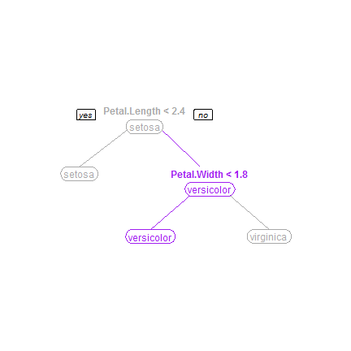

Shiny App Pitch: Classifying Iris Species
========================================================
author: 
date: 2014-Oct-26


Description of Shiny App    
========================================================
This app classifies different iris species by using the measurements (width/length) of the flower petal and sepal leaves.

This app has four tabs that show:
- Input values from the sliders and the predicted iris species

- A classification tree.

- Boxplots of the flower measurements categorized by iris species.

- A summary of the flower measurement of the classified iris species.

First
========================================================
transition: rotate

The Flower measurements are collected from the shiny app sliders and stored in 'Newdata'.  


```r
# NewData is used for the predict function
Newdata <- data.frame(Sepal.Length = 6, 
                      Sepal.Width = 4.5, 
                      Petal.Length = 7, 
                      Petal.Width = 1.7)
print(xtable(Newdata), type="html")
```

<!-- html table generated in R 3.1.1 by xtable 1.7-4 package -->
<!-- Sun Oct 26 14:32:28 2014 -->
<table border=1>
<tr> <th>  </th> <th> Sepal.Length </th> <th> Sepal.Width </th> <th> Petal.Length </th> <th> Petal.Width </th>  </tr>
  <tr> <td align="right"> 1 </td> <td align="right"> 6.00 </td> <td align="right"> 4.50 </td> <td align="right"> 7.00 </td> <td align="right"> 1.70 </td> </tr>
   </table>

Then
========================================================
A decision tree model is created to classify the iris species. 


```r
MyIris <- iris
modelFit <-train(Species~., 
                 method="rpart", data=MyIris)
trees <- modelFit$finalModel

newPred <- predict(modelFit,Newdata)
```

Based on these measurements, this is a Iris **versicolor** flower.

Finally
========================================================
transition: fade
The output prediction is visualized!
Below is a example the decision tree plot in the shiny app.



To try this awesome shiny app [click here](http://kddill.shinyapps.io/shinyapp)!!!!
